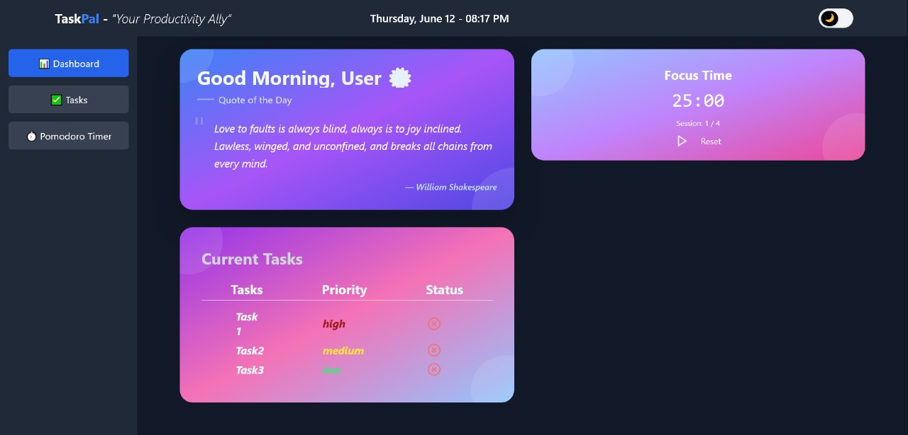

# 🧠 TaskPal - Your Personal Productivity Companion

*TaskPal* is a modern productivity app built with *React, **Vite, and **Tailwind CSS. It combines task management with a built-in **Pomodoro Timer* to help you stay focused and organized.

 <!-- Replace with actual screenshot -->

---

## 🚀 Features

- ✅ *Dashboard Overview*
  - Easily view your productivity tools in one place
- ⏲ *Pomodoro Timer*
  - Focused work sessions with automatic break handling
- 🧭 *Sidebar Navigation*
  - Quick access to all sections
- 💡 *Minimalist UI*
  - Clean design using Tailwind CSS
- 🔧 *Component-Based Architecture*
  - Easy to scale and maintain

---

## 📁 Project Structure
``` Bash
Taskpal-React/
├── public/                 # Static assets (e.g., favicon, images)
├── src/                    # Main source code
│   ├── components/         # Reusable React components
│   │   ├── DashBoard.jsx
│   │   ├── Header.jsx
│   │   ├── Pomodoro.jsx
│   │   ├── PomodoroWidget.jsx
│   │   ├── Settings.jsx
│   │   └── SideBar.jsx
│   ├── App.jsx             # Root component
│   ├── main.jsx            # Entry point
│   ├── index.css           # Global styles
│   └── style.css           # Additional styling
├── .eslintrc.cjs           # ESLint config
├── tailwind.config.cjs     # Tailwind CSS config
├── vite.config.js          # Vite config
├── package.json            # Project metadata and dependencies
└── README.md               # Project documentation